# 《BIS Annual Economic Report 2026 (完整版)》核心观点报告

本报告覆盖 BIS 2026 年年报全部 83 节内容，围绕三条主线展开：一是"进展与风险"并存的一年——2025 年关税冲击被实际税率下调与 AI 资本开支繁荣部分抵消，但 2026 年 2 月底霍尔木兹海峡封锁把冲击源从"贸易"切换为"能源实物断供"；二是高公共债务与国债市场中介结构从银行转向对冲基金等非银机构（NBFI）所形成的新型财政—金融稳定联结；三是"锚定货币信任"——BIS 明确判定现行稳定币设计不满足货币的基础属性，主张"先修补、再升级"，把代币化纳入以央行准备金为锚的双层体系。全篇的核心政策主旨是：价格稳定、金融稳定与财政可持续三者不可分割，各自履行本责才能扩大其他领域的操作空间。

## 一、报告整体框架与章节核心观点

### 1. 前言：从"韧性"到"稳健性"？（Preface: From resilience to robustness?）

* **2025 年增长韧性被三重因素抵消关税冲击**：报告把过去一年的超预期增长归因于三点——有效关税低于初判（豁免、贸易协议与克制反制）、AI 乐观推动美国 AI 基建资本开支并沿全球供应链外溢、以及 AI"动物精神"抬升估值维持宽松金融条件；但报告直言这三根支柱"每一项都在承压" [1](#ref-1)。
* **通胀风险扩散到能源以外的关键投入品**：霍尔木兹断供后塑料价格上涨 30%、化肥上涨 50%，全球通胀在冲突后即抬头；更关键的是报告警告"后疫情通胀记忆犹新"可能使通胀预期**比过去更快脱锚**——把记忆效应视为风险放大器而非稳定器 [2](#ref-2)[3](#ref-3)。
* **财政空间不再是慢变量而成为市场定价的快变量**：财政衰退期扩张、复苏期不整固导致债务棘轮上行，而国债市场结构变化使流动性"可长期看似充裕、却骤然消失"，因此**财政空间会在长期基本面所暗示的极限到来之前就先行收缩** [4](#ref-4)。
* **政策优先级与稳定币的双向渠道**：报告把"央行独立性 → 锚定长端利率 → 反过来扩大财政空间"确立为政策主线，并要求流动性后盾"临时、定向、可逆"；同时指出稳定币既可抬高银行融资成本与不稳定性，也可通过增加主权债需求降低发行国利息支出 [5](#ref-5)[6](#ref-6)。

### 2. 第一章：进展与风险（I. Progress and peril）

* **关税冲击的产出损失被高估约三分之一**：2025 下半年美国有效平均关税率稳定在 10%，显著低于宣布的 25% 以上峰值，考虑此点后全球产出损失比初始估计**减少约三分之一**；受冲击最大的美国企业以利润吸收了约**三分之二的成本上涨**，仅三分之一传导给消费者，意味着关税的通胀效应被推迟而非消失 [7](#ref-7)[8](#ref-8)。

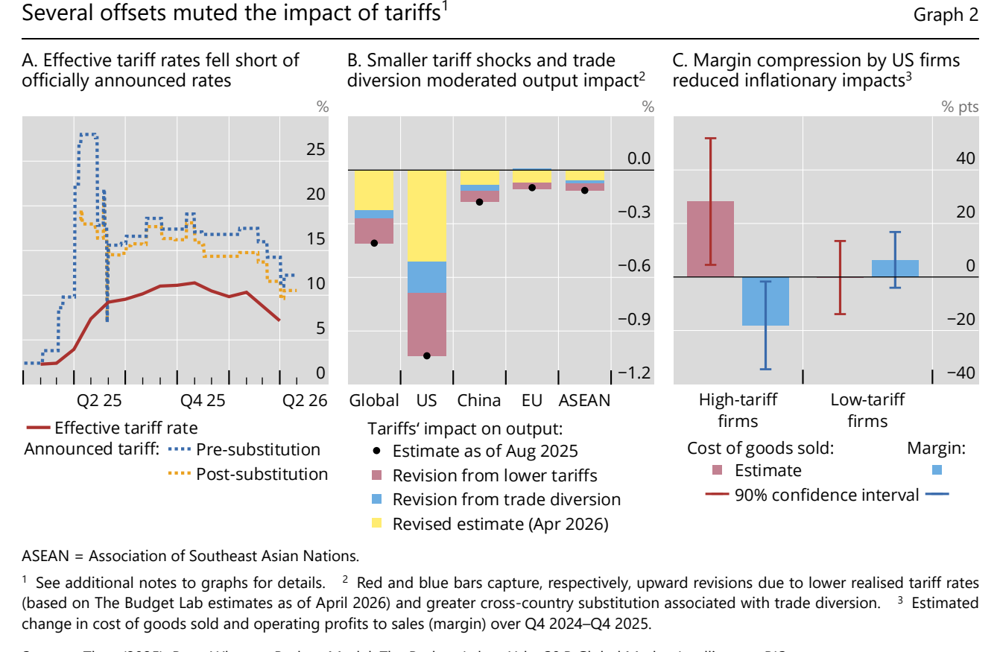

* **霍尔木兹冲击在量级上超过 1970 年代能源危机，且部分损害不可逆**：原油流量削减逾 1,000 万桶/日、相当于正常供给的 13%（1970 年代供给损失约 8%）；IEA 释放 4 亿桶战略储备——史上最大规模——**也仅覆盖 20 天的霍尔木兹流量损失**，沙特东西管道最多转向 500 万桶/日且自身受攻击风险 [9](#ref-9)[10](#ref-10)。

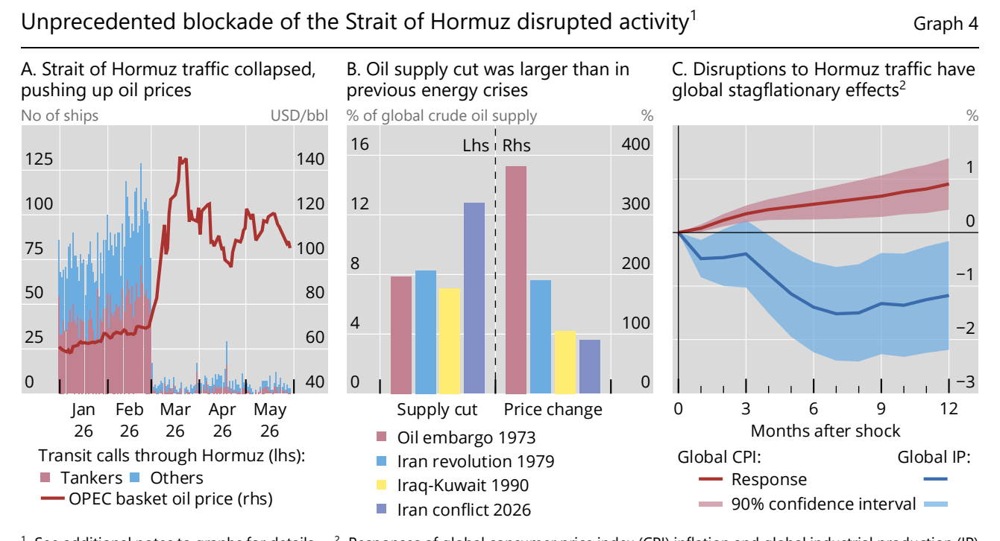

* **市场定价与实体损伤存在"醒目落差"**：全球股市 2 月末至 3 月末下跌 9%（标普 500 跌 8%），远小于 2025 年关税冲击的 19%、1990 年海湾战争的 17%、1979 年伊朗革命的 17%；隐含波动率与尾部风险指标已回到冲突前水平，报告直言市场可能未充分计入下行风险 [11](#ref-11)。
* **AI 繁荣的信用脆弱性：资本开支已转为债务驱动，且存在循环融资**：五大超大规模云厂商 2025–2026 年 AI 相关资本开支合计**超 1 万亿美元**，已超出其盈利与自由现金流，部分企业转向发债（2026 年发行预测约 1,600 亿美元，较 2025 年翻倍）；AI lab 与 hyperscaler 支出中循环融资占比约 50%–57%，交易条款披露差、存在**同一资产被多次质押**的风险 [12](#ref-12)[13](#ref-13)。

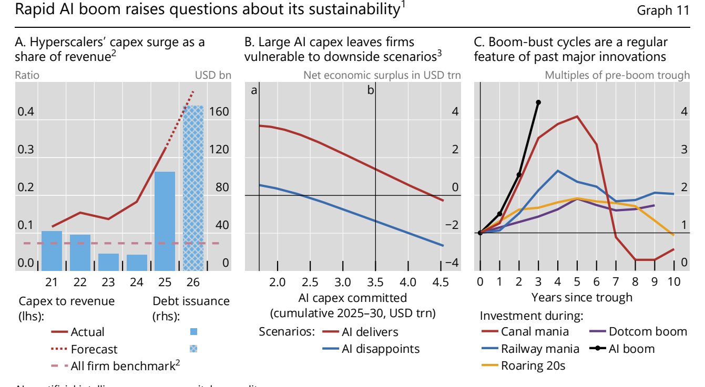

* **r-g 反转与供给冲击常态化：债务动态失去名义增长的庇护**：10 年期国债收益率与潜在名义 GDP 增长之差由深度为负转正（德国由约 -4pp 收窄至约 -1pp，法/英/意/挪/加由负转正），国家不能再依赖名义增长稳定债务；同时疫情以来**负面供给冲击的频率已超过负面需求冲击，打破了疫情前格局** [14](#ref-14)[15](#ref-15)。

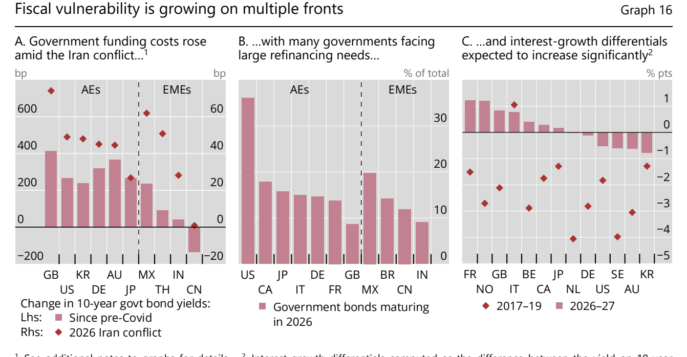

### 3. 第二章：高公共债务与变迁中的金融市场——对央行的挑战（II. High public debt and shifting financial markets: challenges for central banks）

* **财政空间的约束来自金融中介状态，而非长期基本面**：报告把利率方程扩展为 r_t = r̄ − γ(x) + a(x)b_t，其中金融条件 x 同时决定息差压缩项 γ 与市场深度项 a；金融条件恶化会**同时"上移并旋转"融资成本曲线**，使稳态债务上升、债务上限内移，因此财政空间可在基本面与长期 r−g 完全不变时收缩；值得注意的是，即使不存在投资者协调失败，中介资产负债表动态与风险约束也能放大收益率冲击 [16](#ref-16)[17](#ref-17)。

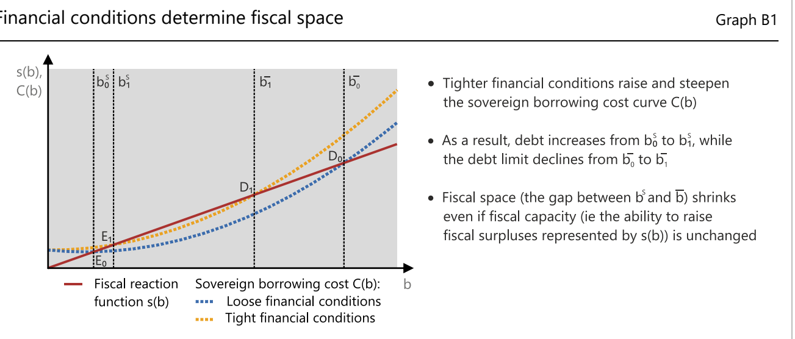

* **"好时光也没整固"，且 r-g 对违约几乎没有预测力**：稳定债务所需的"债务上升→初级盈余调整"正向反应在 1980s–90s 存在，到 2024 年已完全消失；2022 年以来发达经济体周期性调整后基础赤字平均 1.9% of GDP，接近此前二十年 1.1% 的近两倍，新兴市场更从 0.1% 恶化到 1.8%；而基于 55 国、最长 200 年数据的证据显示 **r-g 差对主权违约"几乎没有预测力"**，危机往往发生在 r-g 处于低位或负值时 [18](#ref-18)[19](#ref-19)。

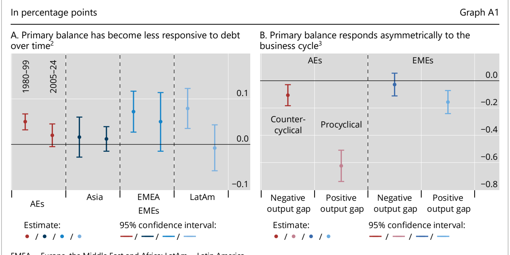

* **国债中介结构已转移到高杠杆 NBFI**：NBFI 持有发达经济体主权债的份额从 2021 年 44% 升至 2025 年 **53%**，同期国内央行份额由 27% 降至 17%、外国官方部门由 15% 降至 13%；融资条件极度宽松——约 70% 的双边美元回购与逾 50% 的双边欧元回购**以零折扣成交**，且最优惠条件集中于最大型基金；银行主权敞口/一级资本中位数在 EME 约 180%、AE 略低于 100% [20](#ref-20)[21](#ref-21)。

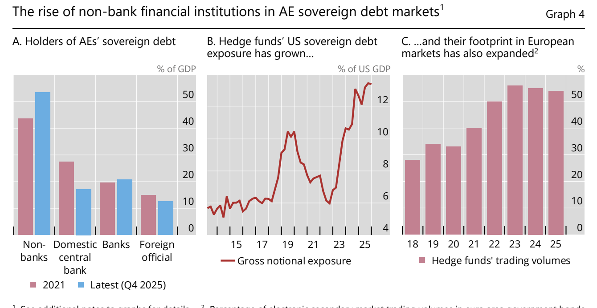

* **高债务使市场功能失灵概率放大约 10 倍，并系统性削弱货币传导**：在美国国债市场，债务/GDP 处于历史高位时，未来三个月发生类似 GFC 级压力事件的概率约 3.8%，低债务状态下仅约 0.3%；传导渠道被拆为三条方向不一的路径——财政风险重定价、估值、利息收入，其中**利息收入渠道同时削弱产出收缩与反通胀**；欧元区反事实显示债务率 120% 的国家反通胀反应弱于 60% 的国家，且期限结构影响呈 U 型 [22](#ref-22)[23](#ref-23)。

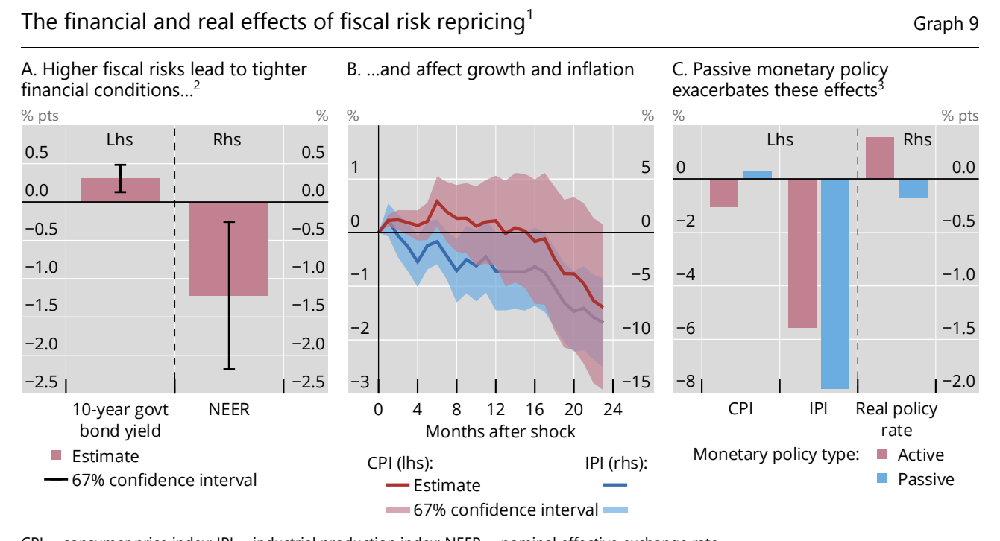

* **政策处方的方向与直觉相反**：由于高额付息削弱紧缩对通胀的影响，报告结论是可能**需要更强的政策反应**而非更温和；财政整固应采用"触发式"时点——除非市场准入受威胁，应在活动复苏稳固、金融条件正常化后推进，且一刀切削减公共投资可能自我挫败；监管上则直指零折扣实质上"允许对冲基金等参与者想加多少杠杆就加多少" [24](#ref-24)[25](#ref-25)[26](#ref-26)。

### 4. 第三章：锚定货币信任——超越稳定币的创新（III. Anchoring trust in money: innovation beyond stablecoins）

* **现行稳定币不满足货币的基础属性**：报告把判准从三大职能转向"被无需多问地接受为最终清偿"的信息不敏感属性；货币单一性要求以面值、以央行货币终结性兑付，而**即使极小的非面值兑换在好天气下或可维系、压力来临即会瓦解**；稳定币既不在央行资产负债表上直接或间接结算，又受"先收现金再发行"制约供给弹性，因此当前设计更接近 **ETF 份额而非支付手段**，要真正规模化还需常备便利或等效支持来遏制挤兑 [27](#ref-27)[28](#ref-28)。

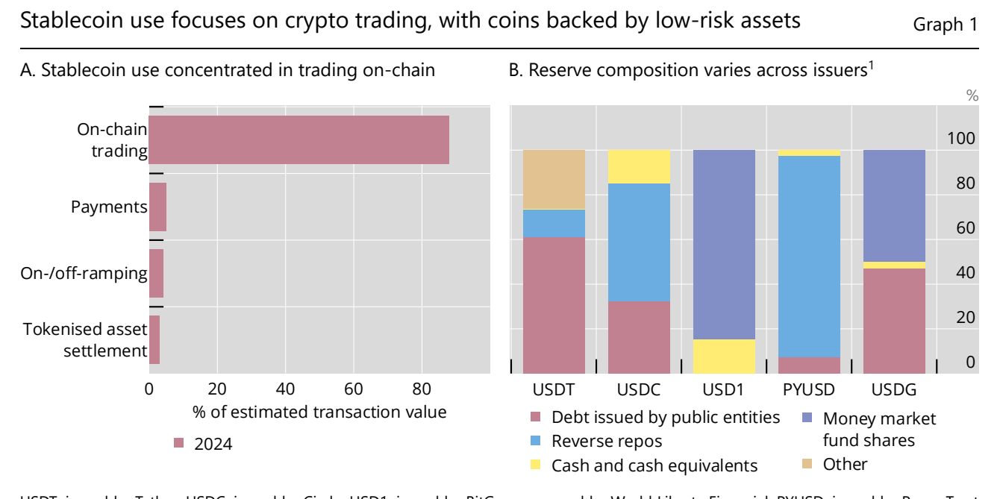

* **规模与货币属性：99.4% 锚定美元，实际结算量远小于宣传**：法币抵押稳定币按市值计 **99.4% 锚定美元**，非美元稳定币占比不足 0.3%，且成熟辖区的监管框架"本身并未催生大规模非美元合规稳定币市场"；年度链上交易量约 28 万亿美元，但不到美国最大批发支付系统**三个工作日**的结算量，经调整后年交易额约 3,900 亿美元、**不到总额的 1%**（CHIPS 每营业日清算约 2.2 万亿美元）[29](#ref-29)[30](#ref-30)。
* **公链的经济学缺陷是结构性的，而非工程未成熟**：手续费上升、确认变慢与拥堵是激励机制维持验证者诚实行为的**必然代价**，因此无法靠技术升级根治；为提效而采用的委托权益证明实质上把验证权集中到小型验证者群体，等于**向中心化回退**；同一发行方在不同链上的稳定币版本"实际上各自构成不同资产"，跨链桥与跨链转移既困难又引入新的操作风险，直接危及货币单一性 [31](#ref-31)[32](#ref-32)。

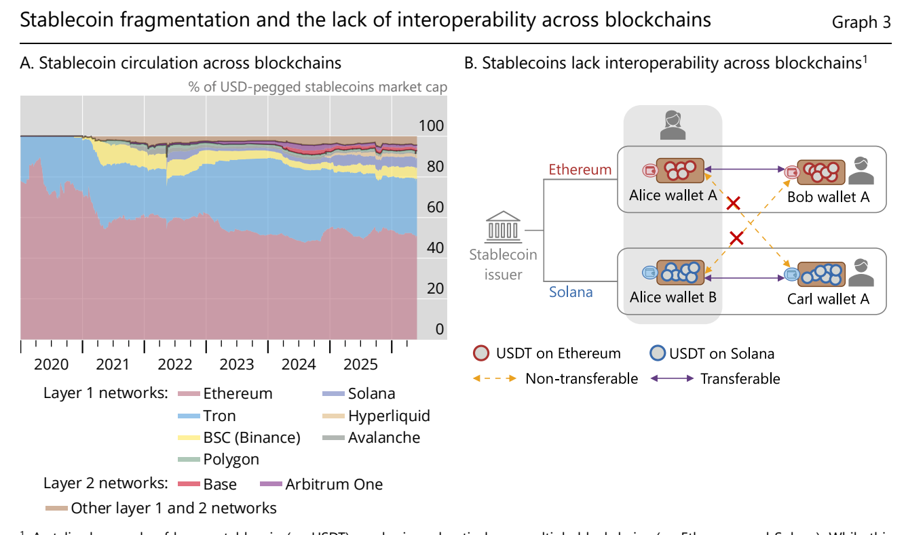

* **宏观金融量化：两条反向渠道，净效应模糊且数量温和**：家庭存款转为稳定币后，银行的**颗粒化零售存款被集中的利率敏感批发存款替代**，批发存款流失率更高导致 LCR 下降、被视为更不稳定的资金来源导致 NSFR 下降，即使资产端部门层面起初不变、平均流动性指标也已恶化；基于美国校准的一般均衡模型显示，银行资金成本与信贷的负面影响**压过**财政空间收益，中期净产出为负但幅度温和（即使市值达 1–3 万亿美元）[33](#ref-33)[34](#ref-34)。

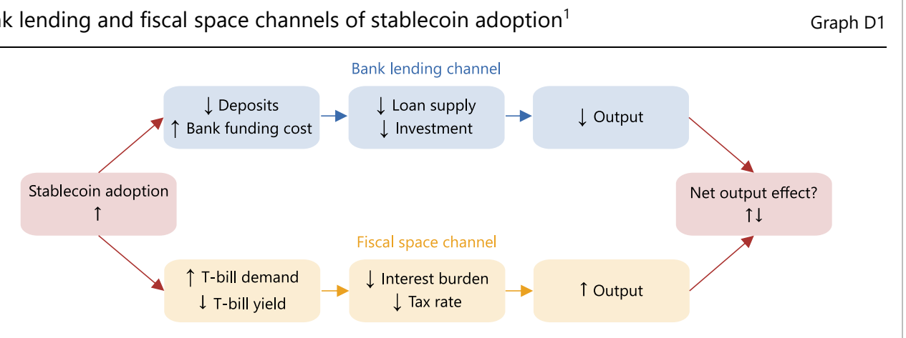

* **美元化风险与政策路径：单边限制无效，出路在双层体系的代币化升级**：存款美元化中位数 1995–2019 年几乎不变（约 20%–25%）、危机后长年高企，提示经由稳定币的美元化"可能相当持久"；而关键实证发现是**对居民与非居民间稳定币使用的限制几乎不起作用**（受限经济体流入中位数约 1.5% vs 不受限约 1.7%，而外币存款限制可将美元化中位数从约 29% 压到约 2%），因为稳定币的"数字无记名"性质与非托管钱包更易规避资本管制；政策路径因此是"修补现行稳定币 + 在双层体系内代币化"，以**央行货币为信任锚与货币单一性的基础**，Project Agorá 由 8 家央行与 40 多家受监管机构测试共享跨境平台并已验证原子结算 [35](#ref-35)[36](#ref-36)[37](#ref-37)。

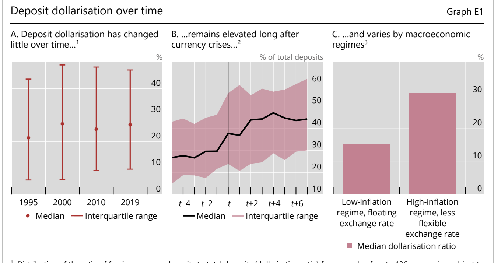

## 二、核心 Box（专题研究）深度提炼

### 第一章专题

* **Box A：全球供应链的适应性与脆弱性（Global supply chains: adaptability and vulnerability）**：论点链条是"关税→产能地理转移→区域份额稳定"，而非"脱钩"。中国对东盟直接投资从 2017 年 100 亿美元增至 2024 年 340 亿美元以上（三倍以上），美国自华进口份额持续下降但自其他亚洲经济体的进口按比例上升，美国进口的亚洲区域份额稳定在约 60%；同时 AI 相关投资对 2025 年美国实际 GDP 增长贡献约 1 个百分点并向亚洲 AI 供应链外溢 [38](#ref-38)。脆弱性一侧以**氦气**为例：氦在半导体价值链中货值占比极小，但作为化学惰性、高导热的清洗与冷却剂不可替代，生产高度集中于卡塔尔等少数国家，霍尔木兹封锁冲击大量依赖卡塔尔氦气的亚洲经济体——即**低经济价值的关键投入品足以形成卡点并危及整条供应链**，处方是供应商与运输路线多元化、必要时共建战略储备 [39](#ref-39)。
* **Box B：伊朗冲突的持续经济影响（The persistent economic effects of the Iran conflict）**：机制链条为"储罐满溢→被迫关井→结构性损伤→永久性产能损失"。海湾产油国关井使区域原油供给从 2,100 万桶/日削减约 1,200 万桶/日；难点不只在数量，还在**油品等级错配**（亚洲炼厂按重质高硫原油优化，轻甜替代品利润更低故宁减产），且关井会损伤油井、部分成熟井可能永远无法恢复产能或重启在经济上不可行 [40](#ref-40)。第二条链条是"回补库存本身成为紧缩来源"：美、中、日、欧同时回补战略储备，叠加清堵船舶（亚洲到港再加 3–6 周）与受损基础设施修复，实货市场紧张可能**延续至 2027 年**；报告并提及冲突前 LNG 压缩机燃气轮机订单积压已达 3–5 年，构成额外瓶颈 [41](#ref-41)。

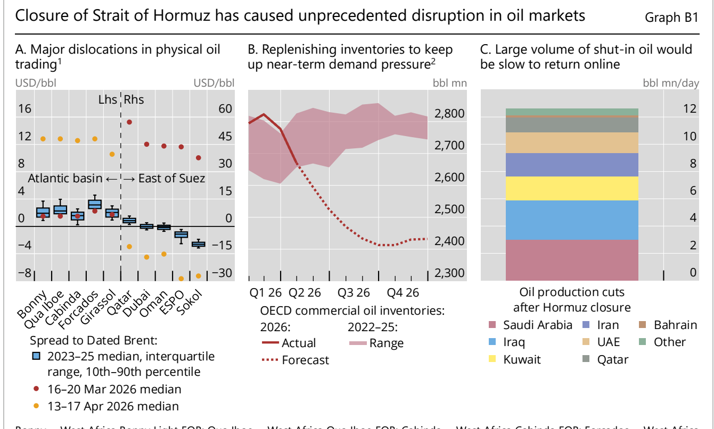

* **Box C：变革性 AI、长期增长与 r-star（Transformative AI, long-term growth and r-star）**：本框以"三个层次"给出情景依赖的判断。**第一层是技术机制**：AI 的特殊性在于增强"知识本身的生产"，从而可能解除长期增长的关键约束；但若任务间强互补，产出将受"改善最慢的任务（最弱环节）"约束——即**总体产出受制于改善最慢的环节**，报告明确判断当前经济体仍处在互补性 regime，变革性情景是可能性而非现实 [42](#ref-42)。**第二层是需求瓶颈（本框最具增量的机制）**：既有框架均假设需求跟随供给，而 Box C 指出自动化把原本用于消费的收入转向 AI 投资，**消费基础随产能扩张而被侵蚀**，前瞻性企业预见未来市场缩小后会放弃下一项自动化任务，因此生产率停滞的成因是支撑扩产的需求缺失；模拟显示需求瓶颈下趋势增长率先升至约 2.5%，2040 年前后回落至约 1.5%（低于 2% 历史趋势），劳动份额降至约 50%；脚注并引研究指出该机制可在新凯恩斯框架下打开**需求缺口与流动性陷阱**，且存在"AI 裁员陷阱"式的过度自动化 [43](#ref-43)。**第三层是 r-star 与通胀的方向依赖**：2040 年自然利率在变革性 AI 情景约 2.0%、有界生产率提升约 1.5%、需求瓶颈约 1.0%、BAU 约 0.5%；中期通胀压力与 r-star 同向——需求瓶颈主导则**趋于通缩**，预期生产率净提振需求则**趋于通胀**，即"r-star 先随供给面力量上升、随后跌破 AI 前的基线" [44](#ref-44)。这意味着"AI 必然推高中性利率"并非定论，且 Box C 的情景模拟主要建立在尚未发表的工作论文之上，应作为情景而非基准预测使用。

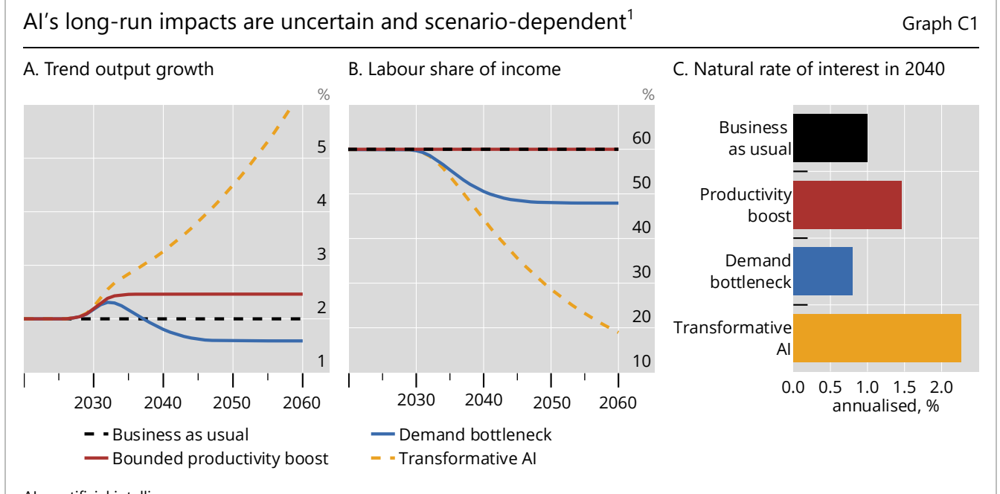

### 第二章专题

* **Box A：景气期债务整固不足（Insufficient debt consolidation in good times）**：核心量化是"反应系数归零"——稳定债务要求初级余额随债务利息成本调整，这一正向反应在 1980s–90s 存在，**到 2024 年已完全消失**，诱因包括负的 r-g 差被当作额外财政空间来源、"财政疲劳"与政治极化 [18](#ref-18)。更反直觉的是反应的**非对称性**：产出低于潜在时顺周期扩张，而**产出缺口为正时财政政策在发达经济体反而倾向顺周期**——好时光也在消耗财政空间（该非对称性自 2005 年以来似乎加强）[45](#ref-45)。报告并指出，智利、丹麦、瑞典等国能在好时光整固，更与"更强的制度框架 + 更低初始债务"相关，而非仅仅因为有财政规则；同时明确 **r-g 差只在危机前很短时间才抬升**，以 r-g 为核心的监控体系存在系统性盲区。
* **Box B：为什么金融中介对财政空间至关重要（Why financial intermediation matters for fiscal space）**：完整论点链条是"背景→机制→稳态→结论"：金融体系并非在给定利率上被动吸收国债；把利率方程扩展为 r_t = r̄ − γ(x) + a(x)b_t，其中 x 概括中介资本、市场波动、内部风控与监管约束，**γ(x) 反映充裕流动性带来的息差压缩**，条件收紧时 γ 下降直接抬高融资成本；**a(x) 刻画市场深度，即借贷成本随新增发债上升的陡峭程度**，中介资产负债表转弱时 a 上升 [46](#ref-46)。稳态下成本曲线 C(b) = [r̄ − g − γ(x)]b + a(x)b² 为凸，金融条件恶化同时上移并旋转该曲线，使稳态债务上升、债务上限内移，财政空间 = b̄ − b_s 因而是**时变的而非基本面决定的存量概念**。报告特别区分了本机制与传统"自我实现的流动性危机"文献：后者根源是投资者协调失败，而在当代以 NBFI 为主的国债市场中，即使不存在协调失败，**资产负债表动态与风险约束也能放大收益率冲击**——这决定了央行应做"最后做市商"还是"资产负债表修复者"的政策分野，并建议把市场深度、中介资产负债表能力与流动性直接嵌入债务可持续性分析的核心模型，而非"分别打分后汇总"。

### 第三章专题

* **Box A：货币与央行的历史起源（The historical emergence of money and of central banking）**：Box A 以数个史例论证"私人货币最终需要公共锚"。史实链条为：货币是最早的信用承诺关系 → 随信用网络扩大被商品货币替代（贝币、琥珀金等在旧大陆与新大陆**独立出现**）→ 近代早期欧洲公共银行发行可用于清偿其他金融索取权的"金融货币"；央行"按构造"发行其货币域内最安全、最流动的索取权，**提供货币基石（numeraire）与压力期弹性支持的资产负债表** [47](#ref-47)。案例包括：1609 年成立的阿姆斯特丹银行以"制止铸币混乱"为宗旨、推出统一标准荷兰银行盾，荷兰盾由此成为第一个真正的全球储备货币；1763 年危机中该行入场稳定体系、确保汇票继续被接受，预示了此后数百年的最后贷款人角色；而其 1780 年代倒台缘于**向关联实体大规模放贷与缺乏财政后盾**，说明"法币的限度"与制度不稳健时信任如何动摇 [48](#ref-48)；1805 年特拉法加海战切断西班牙银元（18 世纪"参考货币"）流动，引发法西信贷大幅收缩，说明**依赖外部供给的参照/结算资产极为脆弱** [49](#ref-49)；美国 Suffolk Bank 于 1825–1858 年运营新英格兰票据清算体系、以红墨水盖章倒闭银行钞票，其**巨额利润表明这门生意是自然垄断**，这些职能最终由 1913 年成立的美联储接管 [50](#ref-50)。结论具有直接的当代含义：货币质量评估与清算层最终必然回归公共提供。
* **Box B：公共无许可区块链的经济学（The economics of public permissionless blockchains）**：Box B 用福利经济学语言把公链生态的现状定性为"**租金、负外部性与拥堵**并存，且碎片化正在侵蚀网络效应"，并强调这些**不是技术缺陷而是去中心化系统的结构性特征** [51](#ref-51)。机制上：为保住验证者诚实行为必须容忍成本与不公平，故手续费上升、确认变慢与拥堵无法靠升级根治；提升效率的委托权益证明等机制把验证权集中到小型选举/轮换验证者群体，**实质上偏离了去中心化与移除中介的初衷** [52](#ref-52)；碎片化同时发生在 L1 与 L2 两层（以太坊份额从 2020 年约 90% 降至约 50%，L2 中 Arbitrum One 从约 60% 降至约 30%），跨链桥覆盖不完整且存在成本与安全隐患，使得"同一发行方、不同链"的稳定币实质上成为不同资产。
* **Box C：稳定币的监管框架（Regulatory frameworks for stablecoins）**：六个辖区（欧盟、香港特区、日本、新加坡、英国、美国）的框架收敛于**三大共同支柱——强制平价赎回、储备全额覆盖、限制向持有者付息**，分歧则集中在赎回条件、储备构成、央行账户准入与资本校准，因此跨境经营时差异会塑造商业模式与风险传导渠道 [53](#ref-53)。最具体的量化设计来自英国：系统性英镑稳定币要求**至少 40% 储备为无息央行存款、最多 60% 为短期英国国债**，储备须法定信托隔离并留在境内——无息要求意味着发行方收益归央行（与 Box D 的铸币税归属逻辑直接衔接） [54](#ref-54)。央行账户与最后贷款人准入高度不均衡：六辖区中**仅英国考虑给系统性稳定币发行方 LOLR 准入**，香港特区、新加坡不给任何央行账户或便利。而最关键的政策埋点出现在脚注：正文的"禁止付息"仅约束发行人，**"非发行第三方在适用约束下仍可提供报酬或类似利益"**，意味着 DeFi 借贷池与交易所理财等第三方渠道仍可制造事实上的利息，从而打开银行脱媒的强度上限 [55](#ref-55)。资本与破产方面，美国 GENIUS Act 明确**银行资本规则不自动延伸至银行子公司的稳定币业务**，并将持有者对储备的求偿权提升至优先顺位，可能诱发集团内监管套利。
* **Box D：量化稳定币对银行放贷与财政空间的影响（Quantifying the impact of stablecoins on bank lending and fiscal space）**：Box D 在含本国/外国家庭、银行部门、稳定币发行方、非金融企业与政府的定量一般均衡模型中（Hofmann、Kaldorf、Rottner 2026）拆出两条方向相反的渠道：**银行放贷渠道**（存款利率上升→银行资金成本上升→信贷收紧→投资产出下降）与**财政空间渠道**（发行方竞买短期国债→收益率下降→政府融资成本下降、因税收扭曲可减税或扩支→产出上升）；由于两渠道方向相反，**稳定币对产出的总体影响在定性与定量上都是模糊的** [56](#ref-56)。关键在于储备资产的选择决定哪条渠道占优：仅以短期国债为储备时净产出"温和为负"，但**高公共债务与高外国需求会改变效应方向**（情景参数为债务/GDP 从 122% 升至 175%、短期国债占比从 18% 升至 24%、50% 的稳定币由海外持有）；**银行批发存款**情景更负面（国债需求端被削弱、银行转向批发融资）；而**央行准备金情景（不计息）下净产出效应可转为正**——因为铸币税收入归央行、财政当局可用其削减扭曲性税收 [57](#ref-57)。但该正效应并不稳健：**若央行按发行方在短期国债上的收益对准备金付息，则央行准备金情景就退化为政府债券情景**，即"是否对准备金付息"这一制度细节决定最终符号 [58](#ref-58)。此外，在央行准备金情景下银行准备金与零售负债被压缩，**央行可能需通过向银行放贷或购买证券被动扩表**，这对"非充裕准备金"框架的可持续性具有直接含义。
* **Box E：存款美元化与稳定币（Deposit dollarisation and stablecoins）**：基线事实是经济美元化的**高度黏滞性**——136 个经济体的外币存款占比中位数在 1995–2019 年间几乎不变（约 20%–25%），危机后 t+6 中位数升至约 45%；高通胀 + 非灵活汇率 regime 的美元化中位数约 28%，低通胀 + 浮动汇率约 15%。由此外推，经由稳定币实现的美元化很可能同样持久。Box E 的埋点式反直觉结论是资本管制效果的**不对称**：对国内外币存款设审批要求的国家美元化显著更低，但对稳定币的使用限制几乎不起作用，原因是稳定币的"数字无记名"性质与非托管钱包使跨境管制"很可能并不完善"，因此有效路径应转向阻断国内中介与跨境协作。货币政策含义被分层给出：**存款美元化较高的经济体货币扩张的通胀效应更大**，但"美元化总体上并未妨碍通胀控制"；真正的二阶风险在于若外国稳定币使用推升外币借款，**负债美元化**会显著抬升金融脆弱性并使货币政策更顺周期，若扩展到实体交易结算则侵蚀本币记账单位职能与货币主权；而历史经验显示去美元化并非不可逆，关键是健全政策框架——**引入通胀目标制、审慎财政、立法保障央行独立性** [59](#ref-59)[60](#ref-60)。

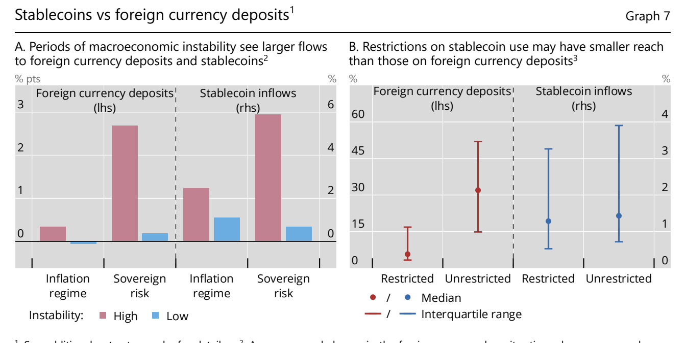

## 三、政策与市场含义

* **供给冲击常态化使"看穿"从原则变为有条件判断，通胀可信度的回报上升**：量化结果显示，石油冲击每季衰减 40% 的 acute 情景下"看穿"带来约 1pp 额外通胀、可避免产出损失约 3.5%；若每季仅衰减 5% 且价格增长按上一季度通胀指数化，额外通胀跳升至约 4pp、产出保护降至约 2.2%——即**指数化是政策结论的分水岭**；因此"冲击更持久、预期更后视时，看穿的理由减弱"，而在供给冲击更频繁的环境下，**投资于通胀可信度的回报上升** [61](#ref-61)[62](#ref-62)。
* **政策三目标互斥已从尾部情景变为现实约束**：报告明确指出财政—金融稳定新联结**首次出现在财政可持续性长期不受质疑的主要发达经济体**，且"政策之间的紧张已在部分经济体显现"；这意味着市场估值中应计入"政策互斥"的风险溢价，而非仅作为情景推演 [63](#ref-63)[64](#ref-64)。
* **央行后盾的边界被同时扩大与收紧，扩大 NBFI 准入以监管为前提**：一方面高债务使央行可能更频繁被要求稳定国债市场，另一方面报告要求后盾"临时、定向、可逆"，并警告反复干预会鼓励加杠杆、固化其本欲解决的脆弱性；制度上指出 NBFI 在许多辖区无法获得贷款便利，因此央行唯一工具是资产购买，而**扩大交易对手准入的前提是这些机构"受到充分监管、至少被监督"**——是否扩大后盾覆盖面将是下一阶段监管设计的核心取舍 [6](#ref-6)[65](#ref-65)。
* **跨境监管协作不可或缺，单边零售端限制已被证明无效**：鉴于稳定币发行方已是部分辖区债券市场的重要参与者、且单边使用限制收效有限，报告把国际协作定位为"不可或缺"，以避免有害碎片化与监管套利，具体工具包括信息共享安排、跨境监管学院、共同数据与报告模板，以及**在监管结果可比时的比例化互认**，并对重要发行方建立处置计划 [66](#ref-66)。

## References（观点出处索引）

| 编号 | 出处（章 / 节） | 页码 | 涉及图表 | 原文摘录 |
|---|---|---|---|---|
| [1](#ref-1) | 前言 / The year in review | — | Graph 3.A-C | the drag from higher trade barriers was lessened by effective tariff rates that were lower than initially anticipated |
| [2](#ref-2) | 前言 / From resilience to robustness? | — | — | prices of plastics and fertilisers – key inputs – have risen by 30% and 50%, respectively |
| [3](#ref-3) | 前言 / From resilience to robustness? | — | — | inflation expectations could de-anchor more quickly than in the past. |
| [4](#ref-4) | 前言 / Old and new fiscal-financial stability nexus | — | — | fiscal space can shrink well before public debt reaches limits suggested by long-run fundamentals. |
| [5](#ref-5) | 前言 / Policy implications | — | — | underpinned by central bank independence, helps to anchor long-term interest rates and expand fiscal space |
| [6](#ref-6) | 前言 / Policy implications | — | — | Central bank liquidity backstops remain critical tools, but they must be temporary, targeted and reversible. |
| [7](#ref-7) | I. Progress and peril / A resilient start | p.17 | Graph 2.B | Accounting for this lowers the global output loss by about a third from initial estimates |
| [8](#ref-8) | I. Progress and peril / A resilient start | p.18 | Graph 2.C | those most affected by the tariffs absorbed about two thirds of the cost increases through lower profits |
| [9](#ref-9) | I. Progress and peril / The conflict and its peril | p.21 | Graph 4.A、4.B | a cut in crude oil flow of over 10 million barrels a day, equivalent to 13% of normal supply |
| [10](#ref-10) | I. Progress and peril / The conflict and its peril | p.21 | Graph 4.B | the largest in history, covered only 20 days of lost Hormuz flow |
| [11](#ref-11) | I. Progress and peril / The conflict and its peril | p.25 | Graph 7.A、7.B | Market-implied volatility and tail risk indicators have moved back close to pre-conflict levels |
| [12](#ref-12) | I. Progress and peril / Financial vulnerabilities as amplifiers | p.32 | Graph 11.A、13.A | The five largest hyperscalers are set to spend over a trillion US dollars on AI-related capital expenditure |
| [13](#ref-13) | I. Progress and peril / Financial vulnerabilities as amplifiers | p.32 | Graph 13.C | with risks of the same asset being pledged multiple times |
| [14](#ref-14) | I. Progress and peril / Fiscal positions under increasing strain | p.36 | Graph 16.C | The gap between bond yields and nominal GDP growth, previously deeply negative, has reversed and turned positive |
| [15](#ref-15) | I. Progress and peril / Endnotes（注 3） | p.38 | Graph 17.A | adverse supply shocks has surpassed that of negative demand shocks, breaking the pre-pandemic pattern |
| [16](#ref-16) | II. High public debt… / Introduction | p.58 | Graph B1 | can shrink even if fiscal fundamentals and the long-run paths of interest rates and growth have not changed |
| [17](#ref-17) | II. High public debt… / Box B | p.58 | Graph B1 | balance sheet dynamics and risk constraints can amplify shocks to yields even in the absence of a coordination failure |
| [18](#ref-18) | II. High public debt… / Box A | p.54 | Graph A1.A | while primary surpluses increased as debt rose in the 1980s and 1990s, this effect vanished by 2024 |
| [19](#ref-19) | II. High public debt… / Endnotes（注 6、12） | — | Graph 3.B、3.C | the interest rate-growth (r-g) differential has essentially no predictive power for government defaults |
| [20](#ref-20) | II. High public debt… / The increasing role of NBFIs in government bond markets | p.60 | Graph 4.A | Their share of total sovereign debt holdings rose from 44% in 2021 to 53% in 2025 |
| [21](#ref-21) | II. High public debt… / The increasing role of NBFIs in government bond markets | p.61 | Graph 5.A、5.B、5.C | 70% of bilateral USD repos and more than 50% of bilateral EUR repos with hedge funds are transacted at zero haircuts |
| [22](#ref-22) | II. High public debt… / Market functioning and fiscal policy interactions | p.63 | Graph 7.C | the probability of experiencing a stress event similar to the GFC within the next three months is about 10 times higher |
| [23](#ref-23) | II. High public debt… / Monetary policy transmission | p.68 | Graph 10.A、10.B、10.C | the interest income channel weakens both the output contraction and the disinflation from rate hikes |
| [24](#ref-24) | II. High public debt… / Monetary policy | p.71 | — | potentially requiring a stronger policy response |
| [25](#ref-25) | II. High public debt… / Fiscal policy | p.72 | — | consolidation should proceed once the recovery in activity has firmed and financial conditions have normalised |
| [26](#ref-26) | II. High public debt… / Regulation | p.73 | Graph 5.C | Zero haircuts effectively allow some market participants, such as hedge funds, to operate with as much leverage |
| [27](#ref-27) | III. Anchoring trust in money / Foundational properties of money | — | — | The absence of par exchange, even if tiny, may suffice in fair weather, but it disintegrates when stress hits |
| [28](#ref-28) | III. Anchoring trust in money / Public permissionless rails and fragmentation | p.90 | — | current stablecoin designs resemble exchange-traded fund (ETF) shares rather than a means of payment |
| [29](#ref-29) | III. Anchoring trust in money / Emergence of stablecoins on public permissionless blockchains | p.87 | Graph 2.B | 99.4% of fiat-backed stablecoins (by market valuation) are pegged to the US dollar |
| [30](#ref-30) | III. Anchoring trust in money / Endnotes（注 29） | p.112 | — | adjusted stablecoin transaction values are closer to $390 billion annually – less than 1% of the total value. |
| [31](#ref-31) | III. Anchoring trust in money / Box B | p.85 | Table B1 | These challenges are not merely technical flaws, but structural features of decentralised systems. |
| [32](#ref-32) | III. Anchoring trust in money / Box B | p.85–86 | Graph B1.A、B1.B | each chain-specific version effectively behaves as a distinct asset |
| [33](#ref-33) | III. Anchoring trust in money / Macroeconomic implications | p.95 | Graph 4 | retail deposits decline and are replaced by concentrated, potentially more rate-sensitive wholesale deposits |
| [34](#ref-34) | III. Anchoring trust in money / Fiscal space | p.96–97 | Graph 5.A、5.B | the adverse effect on bank funding costs and lending tends to outweigh the benefits of additional fiscal space |
| [35](#ref-35) | III. Anchoring trust in money / Box E | p.102 | Graph 7.A、7.B | inflows into stablecoins have been broadly similar in economies with or without restrictions on stablecoin use |
| [36](#ref-36) | III. Anchoring trust in money / Bringing technological innovation into the two-tier system | p.106–107 | Graph 9 | central bank money is the trust anchor and the basis for the singleness of money |
| [37](#ref-37) | III. Anchoring trust in money / DLT network settings | p.106 | — | brings together eight central banks and over 40 regulated institutions to test a shared cross-border platform |
| [38](#ref-38) | I. Progress and peril / Box A: Global supply chains | p.19 | Graph A1.A、A1.B | China's foreign direct investment in ASEAN nations has more than tripled, rising from $10 billion in 2017 |
| [39](#ref-39) | I. Progress and peril / Box A: Global supply chains | p.20 | Graph A1.C | even when their economic values are low, can create a chokepoint and jeopardise the entire supply chain |
| [40](#ref-40) | I. Progress and peril / Box B: The persistent economic effects of the Iran conflict | p.24 | Graph B1.C | Shut-ins have curtailed about 12 million barrels per day from a total regional crude oil supply |
| [41](#ref-41) | I. Progress and peril / Box B: The persistent economic effects of the Iran conflict | p.24 | Graph B1.A、B1.B | the rebuilding of those reserves could keep the physical markets tight for several months, possibly well into 2027 |
| [42](#ref-42) | I. Progress and peril / Box C: Transformative AI, long-term growth and r-star | p.29 | Graph C1.A | overall output would be constrained by the task that is improving slowest, the weakest link |
| [43](#ref-43) | I. Progress and peril / Box C: Transformative AI, long-term growth and r-star | p.29 | Graph C1.A、C1.B | automation increasingly diverts income from labour, which is spent on goods and services, into further AI investment |
| [44](#ref-44) | I. Progress and peril / Box C: Transformative AI, long-term growth and r-star | p.29 | Graph C1.C | r-star initially rises while supply side forces dominate but then falls below its pre-AI baseline |
| [45](#ref-45) | II. High public debt… / Box A: Insufficient debt consolidation in good times | p.55 | Graph A1.B | when output gaps are positive, fiscal policy often moves procyclically, particularly in AEs |
| [46](#ref-46) | II. High public debt… / Box B: Why financial intermediation matters for fiscal space | p.58 | Graph B1 | The coefficient a(x) captures market depth: it measures how steeply borrowing costs rise with additional debt issuance |
| [47](#ref-47) | III. Anchoring trust in money / Box A: The historical emergence of money and of central banking | — | Box A | these institutions supplied the monetary numeraire and a balance sheet capable of elastic support in times of stress |
| [48](#ref-48) | III. Anchoring trust in money / Box A: The historical emergence of money and of central banking | — | Box A | precipitated by large-scale lending to an affiliated entity and a lack of fiscal backing, shows the limits of fiat money |
| [49](#ref-49) | III. Anchoring trust in money / Box A: The historical emergence of money and of central banking | — | Box A | the Battle of Trafalgar cut continental Europe off from the flow of Spanish silver dollars |
| [50](#ref-50) | III. Anchoring trust in money / Box A: The historical emergence of money and of central banking | — | Box A | the large profits of the institution underscored that this business is a natural monopoly |
| [51](#ref-51) | III. Anchoring trust in money / Box B: The economics of public permissionless blockchains | p.85 | Table B1、Graph B1 | one of rents, negative externalities and congestion, with fragmentation eroding network benefits |
| [52](#ref-52) | III. Anchoring trust in money / Box B: The economics of public permissionless blockchains | p.85–86 | Table B1 | they reflect a shift away from the vision of decentralisation and the removal of intermediaries |
| [53](#ref-53) | III. Anchoring trust in money / Box C: Regulatory frameworks for stablecoins | p.92 | — | common pillars of par redemption, fully backed reserves and restrictions on interest to holders |
| [54](#ref-54) | III. Anchoring trust in money / Box C: Regulatory frameworks for stablecoins | p.92 | — | at least 40% of backing as unremunerated central bank deposits and up to 60% in short-dated UK government securities |
| [55](#ref-55) | III. Anchoring trust in money / Box C: Regulatory frameworks for stablecoins（脚注 2） | p.92 | — | Non-issuing third parties may, subject to applicable constraints, be allowed to provide remuneration |
| [56](#ref-56) | III. Anchoring trust in money / Box D: Quantifying the impact of stablecoins on bank lending and fiscal space | p.98 | Graph D1 | the overall effect of stablecoins on output is both qualitatively and quantitatively ambiguous |
| [57](#ref-57) | III. Anchoring trust in money / Box D: Quantifying the impact of stablecoins on bank lending and fiscal space | p.108 | Graph D1、5.B、5.C | the net output effect of widespread stablecoin adoption could turn positive |
| [58](#ref-58) | III. Anchoring trust in money / Box D: Quantifying the impact of stablecoins on bank lending and fiscal space | p.109 | Graph D1 | the central bank reserve scenario would become equivalent to the government bill reserve scenario |
| [59](#ref-59) | III. Anchoring trust in money / Box E: Deposit dollarisation and stablecoins | p.102 | Graph E1.B、7.A | Monetary expansions have tended to have greater inflation effects in economies with higher deposit dollarisation |
| [60](#ref-60) | III. Anchoring trust in money / Box E: Deposit dollarisation and stablecoins | p.102 | Graph E1.C | Sound policy regimes have played a role in de-dollarisation, including the introduction of inflation targeting regimes |
| [61](#ref-61) | I. Progress and peril / Monetary policy | p.28 | Graph 17.B | more protracted supply shocks and more backward-looking expectation formation, the case for looking through weakens |
| [62](#ref-62) | I. Progress and peril / Monetary policy | p.28 | Graph 17.B | In an environment of more frequent supply shocks, the payoff to investing in inflation credibility has increased |
| [63](#ref-63) | II. High public debt… / When fiscal and financial risks reach the central bank | p.66 | — | What is new is the emergence of these links in several major AEs where fiscal sustainability had rarely been in doubt |
| [64](#ref-64) | II. High public debt… / Conclusion | p.73 | — | tensions between policies have already surfaced in some economies |
| [65](#ref-65) | II. High public debt… / The design of central bank backstop facilities | p.72 | — | expanding counterparty access to NBFIs requires them to be adequately regulated and at a minimum supervised |
| [66](#ref-66) | III. Anchoring trust in money / Conclusion | p.109 | — | International cooperation will be indispensable to avoid harmful fragmentation or regulatory arbitrage. |
